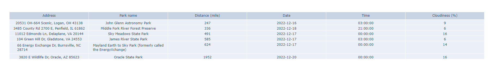

# Final_Project_507 - Spectacular Parks Flask App
## About the Project
Finding a suitable location for stargazing can be very difficult especially for beginners. We need to consider not only the location but also the weather. Currently 
there are no such applications which integrate both location and weather 
recommendation for stargazing. This project is about designing a website that provide 
recommendation for suitable stargazing location based on weather and location 
preferences provided by users.   
 
The project will combine a Google Map API and OpenWeather API to find the best 
location where clouds are less and suitable for stargazing. Users will submit preference for distance, cloud percentage, etc by a 
html form.   
 
The data will be presented by table using Plotly which will ranked by the attribute chosen by 
users. 

## Getting Started

To get a local copy up and running follow these simple example steps.

### Prerequisites

Required Python packages
* pip
  ```sh
  pip install flask requests treelib
  ```

### Installation

1. Get a free map API Key at [https://developers.google.com/maps/documentation/javascript/get-api-key](https://developers.google.com/maps/documentation/javascript/get-api-key)
2. Get a free weather API key at [https://openweathermap.org/](https://openweathermap.org/)
3. Clone the repo
   ```sh
   git clone https://github.com/github_username/repo_name.git
   ```
3. Install Python packages
   ```sh
   pip install flask requests treelib
   ```
4. Enter your API in `secrets_key.py`
   ```py
   MAP_API_KEY = 'ENTER YOUR API KEY'
   WEATHER_API_KEY = 'ENTER YOUR API KEY'
   ```

<p align="right">(<a href="#readme-top">back to top</a>)</p>


<!-- USAGE EXAMPLES -->
## Usage

* Run the `final_project.py` file.

* Head over to [http://127.0.0.1:5000/](http://127.0.0.1:5000/), and you should see the application.

* Fill in your preferences
1. Select whether you want to search by entering a beginning location and find parks near the beginning location or you want to search a park directly
2. Enter your beginning location or your park name if you want to search directly
3. Select whether you want to limit your result to 350 miles from your beginning location. If you search a park directly please select “N/A, I want to search a park directly”
4. Select your desired cloud percentage
5. Select your preferred ranking criteria

* Hit the submit button.

* You will see the results showing in a table.
<p align="center" width="100%">
    
</p >


<p align="right">(<a href="#readme-top">back to top</a>)</p>

## Data Structures

* Data is stored using a tree. The tree contains all the possible preferences and request options. Once the user select a combination of preferences, it will store in the leaf node of the tree. If you run the application, you will see a visualized version of the tree using `treelib` in your terminal, showing the current selected perferences.
* `creste_json.py` is a file that constrcuts the tree from stored data
* `read_json_tree.py` is a file that reads the json of the tree
* `json_tree.json` is a json file with the tree
